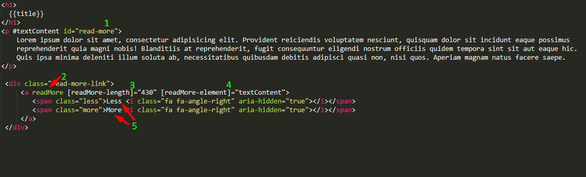

## Read More(toogle text) directive for angular2

<h4>This is a simple toogle text directive for angular2</h4>
 
https://www.npmjs.com/package/ngx-read-more  
 
1. At first step you need mark your text-div and get him id like "read-more" if in you need use it with ngFor -  "read-more{{i}}"
2. Add attribute "read more"
3. Set length of text that we need show by default
4. Set element that we need cut
5. Here is your buttons less and more u can inset whetewer but there are must be 2 elements with classes ".more" and ".less"  

