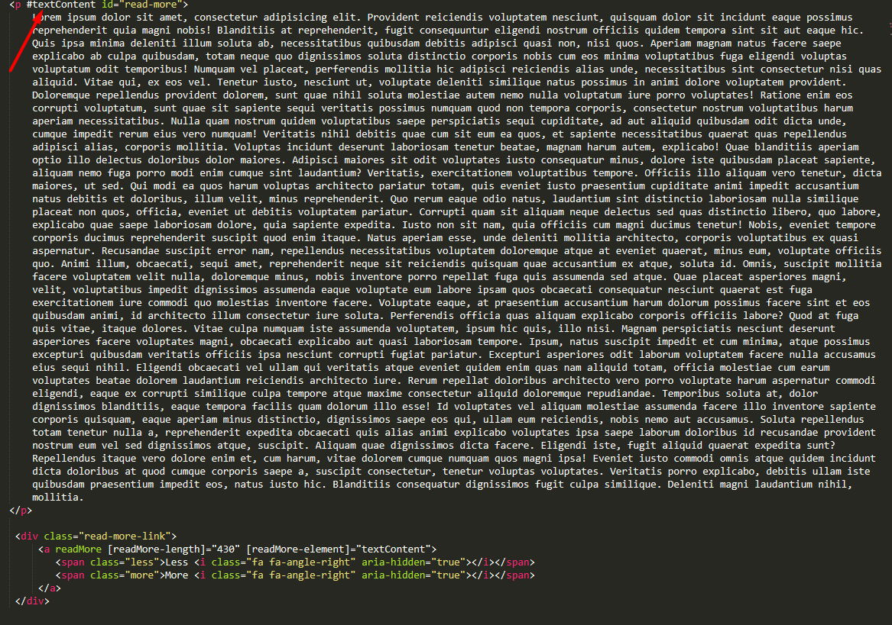
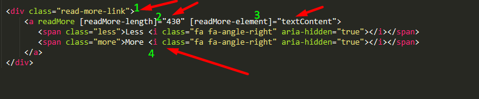

## Read More(toogle text) directive for angular2

<h4>This is a simple toogle text directive for angular2</h4>

At first step you need mark your text-div and get him id like "read-more" if in you need use it with ngFor -  "read-more{{i}}"
 
Then create your button event element

1. Add attribute "read more"
2. Set length of text that we need show by default
3. Set element that we need cut
4. Here is your buttons less and more u can inset whetewer but there are must be 2 elements with classes ".more" and ".less"
